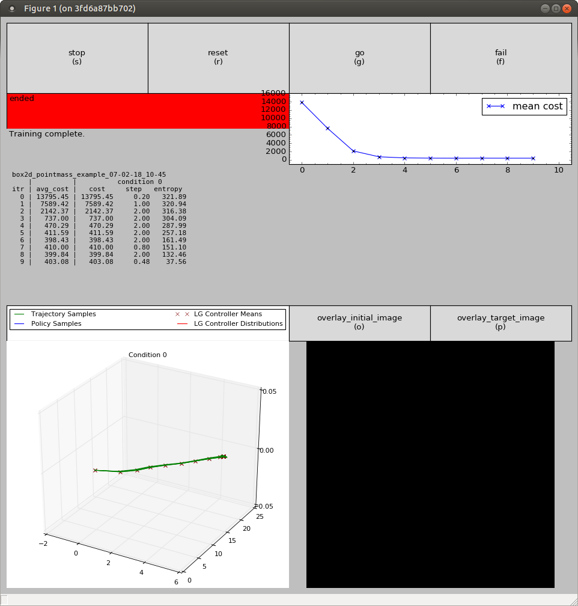
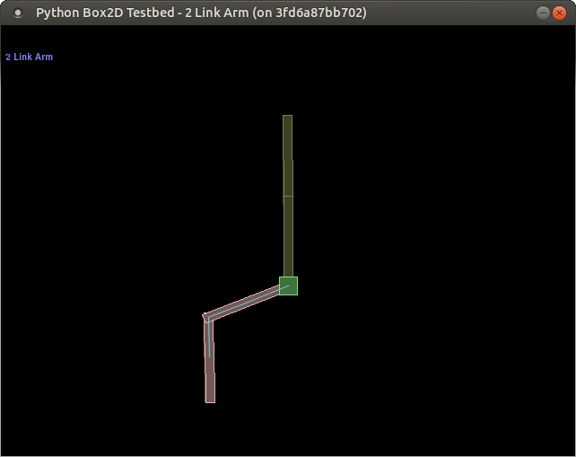
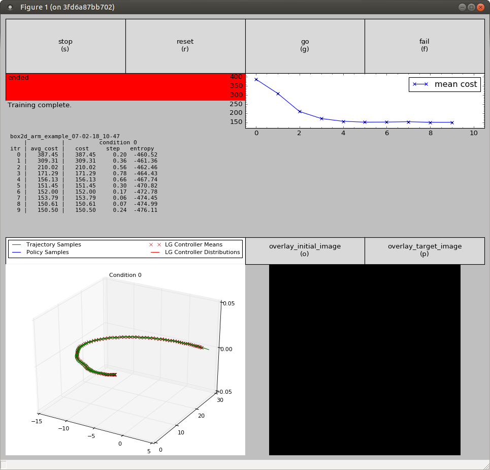

GPS
======

[](https://travis-ci.org/ICRA2017/gps)
[](https://hub.docker.com/r/icra2017/gps/builds/) 

This code is a reimplementation of the guided policy search algorithm and LQG-based trajectory optimization, meant to help others understand, reuse, and build upon existing work.

For full documentation, see [rll.berkeley.edu/gps](http://rll.berkeley.edu/gps).

The code base is **a work in progress**. See the [FAQ](http://rll.berkeley.edu/gps/faq.html) for information on planned future additions to the code.

### Run in Docker

An X-server must be running in the host system, and permission for connections must be granted. 
For more secure configurations, see [this ROS tutorial](http://wiki.ros.org/docker/Tutorials/GUI#Using_X_server).

```
$ docker run -it --env="DISPLAY" --env="QT_X11_NO_MITSHM=1" \
--volume="/tmp/.X11-unix:/tmp/.X11-unix:rw" icra2017/gps
```
#### Box2D example: point mass
```
root@706764b6c478:/# cd gps
root@706764b6c478:/gps# python python/gps/gps_main.py box2d_pointmass_example
...
DEBUG:Generating 12 clusters for dynamics GMM.
DEBUG:Fitting GMM with 12 clusters on 495 points
DEBUG:Initializing GMM.
DEBUG:GMM itr 0/100. Log likelihood: 14197.360530
DEBUG:GMM itr 1/100. Log likelihood: 17651.106275
...
DEBUG:KL: 51.830232 / 47.670362, converged iteration 3
```


#### Box2D example: 2-link arm
```
root@5bc59210b044:/# cd gps
root@5bc59210b044:/gps# python python/gps/gps_main.py box2d_arm_example
...
DEBUG:Generating 12 clusters for dynamics GMM.
DEBUG:Fitting GMM with 12 clusters on 495 points
DEBUG:Initializing GMM.
DEBUG:GMM itr 0/100. Log likelihood: 15557.581060
DEBUG:GMM itr 1/100. Log likelihood: 18412.370399
...
DEBUG:KL: 39.291751 / 41.433764, converged iteration 5
```


